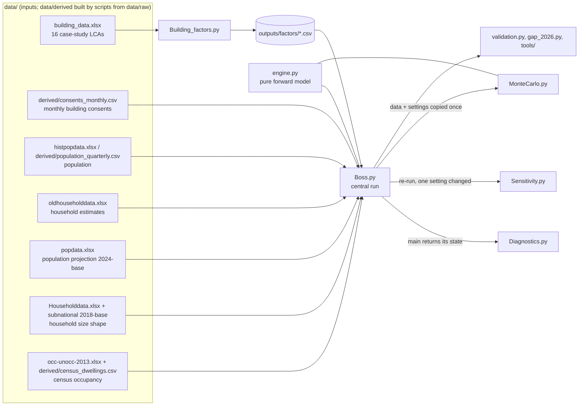

# Architecture: how the model works (baseline v2)

This document is for a reviewer who knows statistics or modelling but not this
code or New Zealand housing data. It describes what each script reads, what it
calculates and in what order, and what it writes. Headline numbers are not
repeated here: they are generated into [RESULTS.md](RESULTS.md),
`outputs/metrics.json` and `outputs/BASELINE_DRAFT.md`. Every setting, with its
basis (data, literature, author decision, judgement), is in
[ASSUMPTIONS.md](ASSUMPTIONS.md). Parameter values quoted below are the adopted
settings in `Boss.py`.

---

## 1. What the model answers

How much new residential floor area New Zealand will build from 2026 to 2050,
and how much embodied carbon that floor area carries, split by building type
(detached, townhouses, apartments), by reason for building (household growth,
vacancy, replacement, ...) and by material and life-cycle stage.

The model is bottom-up and demand-driven: people → households → dwellings
required → floor area → carbon. Construction capacity, prices and policy are not
modelled. Carbon intensities are held at their case-study values (no
decarbonisation is assumed).

---

## 2. Scripts and data flow



`python run_all.py` runs everything in a fixed order (see README), each script
in its own process, and writes to `outputs/`. **One engine:** the forward model
is in `engine.py` (stock calibration, census dwelling-count rates, replacement
path, near-term market excess, typology mix, forward projection). These are pure
functions; `Boss.py` and `MonteCarlo.py` both call them. `Boss.main()` returns a
dictionary of all its local variables, which the other scripts read.

---

## 3. `Building_factors.py`: carbon per square metre

1. Each case study's absolute emissions (by material and EN 15978 stage) are
   divided by its gross floor area (GFA).
2. Materials are grouped into six lines: concrete, steel, timber, plastics &
   paint, plasterboard, others.
3. Buildings are pooled into three typologies: equal weight within sub-type,
   then equal weight across sub-types. A_2 duplicates A_1 (scaled by
   1.000073), so apartments have one independent case.
4. Soil carbon is land-use change, not a material: soil loss per m² of floor =
   soil loss per m² of footprint (58.77 kg CO₂e/m², area-weighted over the soil
   orders of Auckland land zoned for urbanisation) / floor space index.
5. Stage D is written out but never added. Stages in scope: A1–A3, A4–A5,
   B2/B4, C1–C4.

Outputs: `factors_material.csv`, `factors_typology.csv`, `factors_building.csv`.

---

## 4. `Boss.py`: the central projection

### 4.1 Consents (history 1991–2025)

Monthly consents are summed to calendar years: floor area and dwellings by
typology, and an all-category dwelling count. Retirement-village (RV) units =
all-category − three typologies. RV units are dwellings in the stock but carry
no floor area or carbon (no RV case study); forward they are a constant share
of all dwellings built (ratio of sums 2016–2025, 5.6%). RV floor area is
reported separately, out of scope. Realised dwelling size = floor area /
dwellings, held per typology at its 2023–2025 average.

Dwellings built = 0.95 × consents (completion rate; Jones et al. 2024 bounds
0.92–0.96). No completion lag in the adopted run (Little's-law lag is a
sensitivity).

### 4.2 Population and households (history)

Population: estimated resident population at 31 December. Households: Stats NZ
Dwelling and Household Estimates (DHE) at 31 December. After the 2018 base the
DHE series is 0.888 × lagged consents, so increments after June 2018 are
scaled by one factor k = 0.824, chosen so that June 2023 grows over June 2018
by the census ratio of occupied + residents-away private dwellings. 2024–25
household values are consent-derived and not used as evidence (the household
size anchor is 2023).

### 4.3 Net replacement: the census dwelling-count identity

For each intercensal interval: net replacement = (completions − change in
census private dwellings) / stock-years, with completions corrected for the
change in dwellings under construction on census night. This uses neither the
household estimates nor the empty/away split (which breaks between 2013 and
2018). Long run (ratio of sums 1991–2023): 0.101% of stock per year; the
2018–2023 interval: 0.312%. A fixed BRANZ demolition rate (0.135%/yr) splits
the net rate into demolition and a residual (net unconsented additions); only
their sum is identified.

The household stock identity (built = new households + vacancy allowance +
vacancy change + net replacement) is still calibrated and printed for
comparison, and is used by the hindcast with one vacancy definition throughout
(the pooled 2018/2023 empty share).

### 4.4 Replacement scenarios

`engine.replacement_path`: **S1** long-run rate throughout (low); **S3**
the 2018–2023 rate fading to the long-run rate with a 10-year half-life
(reference; 5 and 15 years as sensitivities); **S2** the 2018–2023 rate
persists (high, shares held; with the damped mix trend it is the
"intensification continues" storyline). The half-life is not identifiable from
the census record.

### 4.5 Population projection

Stats NZ 2024-base stochastic projection: the median path is observed 2025 plus
the published median growth (PCHIP between knots); the 5th/95th paths add the
published spread of the *level* about the median, shifted to zero in 2025.
2026 growth is observed (mean-quarter ERP, June quarter 2026 − June quarter
2025); later growth is the projection's, so the level shift is permanent.

### 4.6 Household size

`S_StatsNZ = population / households` at the shared knots of the 2018-base
subnational population and household projections (2018–2043). Interpolation:
one cubic Hermite through every knot (PCHIP derivatives at interior knots, zero
slope at 2043), held constant after 2043. Applied as a shape rebased on the
observed 2023 value; households = population / S for every population path.
Household decline is floored at zero (it becomes vacancy).

### 4.7 Typology mix

Storylines: S1 and S3 hold floor-area shares at their 2022–2026 average; S2
continues a damped additive-log-ratio trend fitted on 2012–2025 (φ = 0.8). 2026
uses the observed consented mix.

### 4.8 Forward requirement and the near-term market excess

```
dwellings built (all categories) = new households + vacancy allowance (v held at the 2023 census)
                                   + net replacement (scenario rate × last year's stock)
                                   + near-term market excess
in-scope dwellings              = dwellings built × (1 − RV share)
floor area                      = in-scope dwellings × blended dwelling size
```

2026 building is observed: 0.95 × consents over the latest 12 observed months
(the year to July 2026). Its excess over the 2026 requirement is booked in
2026; from 2027 building stays above the requirement by gap_ref × ρ^(t−2026),
with gap_ref = building 2026 − requirement 2027 and ρ the estimated persistence
of departures from the calibrated identity. The excess is stock-adding (extra
vacancy, never absorbed); redevelopment booking, payback and the gap against
the 2026 requirement are sensitivities. 2026 floor area is fixed to the
observed consented GFA.

The floor area is reported in demand bands (bookkeeping; they add up to the
total): growth (net of consolidation), house-splitting, extra space per
dwelling, vacancy allowance, long-run background replacement (demolition net of
unconsented additions), the recent redevelopment wave (scenario − long run),
and the near-term market excess. In the figures RV units are removed from every
band in proportion (each band × (1 − RV share)), so all bands are in scope and
sum exactly to the typology total (tested).

### 4.9 Carbon

Floor area by typology × constant intensity, by band, material, soil and stage
(all stages booked in the year of construction). Upfront = A1–A5 + soil. Soil
applies only to floor area on new footprints: zero on the replacement bands
(land already settled).

---

## 5. `Diagnostics.py`

Runs `Boss.main()` once: household engines and the DHE/consent relationship
(diag_2), the stock bucket (diag_3), floor area (diag_4), carbon (diag_5) and
the vacancy-definition appendix (diag_3b). The history of the demand
decomposition is one bar per census interval (interval means, one vacancy
definition): between censuses annual detail is not identified. Accounting
identities and factor sums are checked in `tests/test_identities.py`.

## 6. `Sensitivity.py`

Re-runs `Boss.main()` with one setting changed per row: replacement scenarios
and half-lives, mix, household-size variants and tails, dwelling-size window,
completion rate and lag, census under-construction correction, near-term
booking and gap reference, soil on replacement. Population rows reuse Boss's
5th/95th paths; carbon-factor and soil-order rows re-weight the central floor
area. Writes `outputs/sensitivity_oat.csv`, `sens_1`, `sens_2`. One-at-a-time
ranges are not additive.

## 7. `MonteCarlo.py`

Within each scenario (S3-10 reference, S1, S2): 5,000 Latin hypercube draws of
population rank z (moving population between the published percentile levels
and household size between Stats NZ Low/Medium/High with the same z), a
dwelling-size multiplier, the completion rate (two-piece uniform with median
0.95) and a stratified bootstrap of the carbon factors. Each draw runs the same
`engine.py` chain; the central draw is checked against `Boss.main()` to 1e-9.
Sobol first-order and total indices (reference scenario, 1,024 × 6
evaluations). This is within-scenario parametric uncertainty only; scenario,
mix, carbon-factor and soil bounds are reported separately (sens_1).

## 8. Validation and reports

`validation.py`: rolling-origin hindcast of dwellings built from 2006, 2013 and
2018 (consistent vacancy definition), and the 2026 out-of-sample check (model
run without any 2026 data vs observed consents). `gap_2026.py`: decomposition of
the 2026 gap. `tools/`: near-term rule and scenario reports, report figures,
metrics, RESULTS.md, ASSUMPTIONS.md and BASELINE_DRAFT.md.
`tests/test_regression_v1_2_1.py` checks every headline number against v1.2.1.

---

## 9. Glossary

| term | meaning |
|---|---|
| GFA | gross floor area, m² |
| DHE | Stats NZ Dwelling and Household Estimates |
| ERP | estimated resident population |
| S | average household size = population / households |
| v | vacancy rate = empty private dwellings / all private dwellings |
| RV | retirement-village unit |
| UC | dwellings under construction on census night |
| OLF | occupancy load factor = floor area per design occupant |
| FSI | floor space index = GFA / building footprint |
| ALR | additive log-ratio transform for shares that sum to one |
| φ | damping factor of the mix trend |
| ρ | persistence of departures from the calibrated stock identity |
| PCHIP | piecewise cubic Hermite interpolation, a shape-preserving spline |
| EN 15978 stages | A1–A3 product, A4–A5 construction, B2/B4 maintenance/replacement, C1–C4 end of life, D beyond the life cycle |
| upfront carbon | A1–A5 + soil loss |
