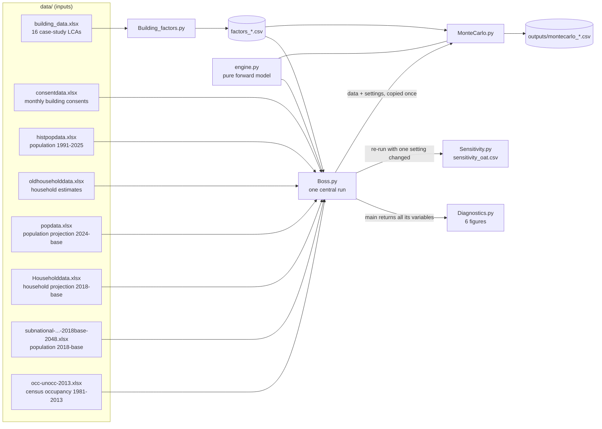

# Architecture: how the model works

This document is for a reviewer who knows statistics or modelling but not this
code or New Zealand housing data. It describes what each script reads, what it
calculates and in what order, and what it writes. It was first written for the
code at commit `e1f98ff` and is updated with each change in `CHANGELOG.md`.
Known problems are **not** discussed here; they are in `ASSESSMENT.md`.

All numbers quoted are from the central run (`Boss.py` with its adopted
settings) unless marked otherwise.

---

## 1. What the model answers

How much new residential floor area New Zealand will build from 2026 to 2050,
and how much embodied carbon that floor area carries. The answer is split
three ways:

* by **building type** (detached houses, townhouses, apartments);
* by **reason for building** (growth in households, vacancy, replacing
  demolished homes, and so on);
* by **material** and **life-cycle stage**.

Central result, 2026–2050: 76.71 million m² of floor area and 29,708 kt CO₂e.

The model is **bottom-up** and **demand-driven**. It starts from people,
turns people into households, households into required dwellings, dwellings
into floor area, and floor area into carbon. Construction capacity, prices
and policy are not modelled.

---

## 2. The five scripts and how data flows between them



Run order: `Building_factors.py` → `Boss.py` → `Diagnostics.py`,
`Sensitivity.py`, `MonteCarlo.py`; `python run_all.py` runs all of them, then
the tests and the validation harness (`validation.py`: rolling-origin
hindcast and the 2026 check, `outputs/validation.md`), and saves every figure
to `outputs/figures/`. `data/` holds inputs
only; everything the scripts write goes to `outputs/`.

**One engine.** The forward model lives in `engine.py`: stock calibration,
2025 deviation, typology mix, dwelling-size blend and the forward projection
from households to carbon. These are pure functions; every input is an
argument. `Boss.py` and `MonteCarlo.py` both call them, so they cannot
disagree. `tests/test_engine_equivalence.py` checks the result against frozen
copies of the code before unification (`tests/legacy/`); see
`outputs/equivalence.md`. The last three import `Boss` and call
`Boss.main()`. That function returns a dictionary of **all its local
variables**, and the three scripts read what they need from it. Census counts
for 2018 and 2023 are typed into `Boss.py` (`CENSUS_LATER`), not read from a file.

---

## 3. `Building_factors.py`: carbon per square metre

**Input.** `building_data.xlsx` has three sheets:

1. LCA results for 16 case-study buildings. For each building it gives kg CO₂e
   by material (concrete, steel, timber, …) and by life-cycle stage, using the
   stage codes of EN 15978: A1–A3 (product manufacture), A4–A5 (transport and
   construction), B2/B4 (maintenance and replacement during use), C1–C4 (end of
   life) and D (benefits beyond the life cycle).
2. Building characteristics: gross floor area (GFA), footprint, design
   occupants, and the occupancy load factor (OLF = floor area per design
   occupant).
3. Soil carbon loss per m² of building footprint for 10 soil orders, plus an
   "area-weighted average" (58.77 kg CO₂e/m² of footprint).

**Steps.**

1. Divide each building's absolute emissions by its GFA, giving kg CO₂e per m².
2. Group materials into six lines: concrete, steel, timber, plastics & paint,
   plasterboard, and "others".
3. **Pool** the buildings into three typologies. Detached houses come in two
   sub-types (single- and two-storey). The code averages within each sub-type
   first, then averages the sub-types, so the six single-storey cases do not
   outweigh the four two-storey ones. Every building gets equal weight within
   its sub-type.
4. **Soil carbon** is treated as land-use change, not as a material:
   `soil loss per m² of floor = soil loss per m² of footprint / FSI`, where the
   floor space index FSI = GFA / footprint. Taller, denser buildings disturb
   less soil per m² of floor.
5. Stage D is written out but never added to totals.
6. Check for duplicated cases: A_2 is A_1 scaled by 1.000073 in every cell, so
   the apartment typology has one independent case.
7. Report the spread across cases: the minimum and maximum single building,
   and a leave-one-out (jackknife) range of the pooled value.

**Outputs.**

| file | content |
|---|---|
| `factors_material.csv` | kg CO₂e/m² by typology × material × stage |
| `factors_typology.csv` | one row per typology: OLF, design occupants, FSI, embodied materials, soil (average, low, high), spread columns |
| `factors_building.csv` | one row per case study (used by the Monte Carlo bootstrap) |

Central intensities (materials + soil, stages A–C): detached 357.9, townhouses
393.1 and apartments 615.3 kg CO₂e/m². These are held **constant** from 2026 to
2050; no decarbonisation is assumed.

---

## 4. `Boss.py`: the central projection

`Boss.main()` runs top to bottom in the numbered sections of the code. The
flags at the top of the file (`HOUSEHOLD_METHOD`, `CONSUMPTION_BASIS`, …) select
between alternative methods. The adopted flags are the ones in the file.

### 4.1 Building consents (history, 1991–2025)

Monthly Stats NZ consent data are summed to calendar years:

* floor area consented by typology;
* number of dwellings consented by typology;
* an all-category dwelling count that also includes retirement-village (RV)
  units. RV units = all-category count − three typologies.

The retirement-village share of all new dwellings is fixed at 5.64% for the
projection: the ratio of sums over 2016–2025. RV units count as dwellings in
the housing stock, but they carry **no** floor area or carbon, because neither
the consent floor area nor the case studies cover them.

**Realised dwelling size** = floor area / dwellings, by typology. For the
projection it is held at its 2023–2025 average: detached 179.6, townhouses
107.7 and apartments 98.1 m² per dwelling.

### 4.2 Population and households (history)

* Population: the estimated resident population at 31 December.
* Households: Stats NZ's quarterly Dwelling and Household Estimates (DHE),
  taken at 31 December.

After the 2018 census the DHE household series is not independently measured.
Stats NZ extends it with 0.885–0.889 × the previous year's consents. The code
therefore **rebases** it on the 2023 census. Every household increment after
June 2018 is multiplied by one factor, k = 0.826, chosen so that June 2023
grows over June 2018 by the same ratio as census households (occupied private
dwellings plus dwellings whose residents were away).

Household size S = population / households. Observed 2025 value: 2.657.

### 4.3 The housing-stock identity (history), and what is calibrated

This is the core of the model. For each historical year:

```
dwellings built  =  new households
                  + vacancy allowance        (new households × v / (1 − v))
                  + vacancy change            (households last year × change in 1/(1 − v))
                  + net replacement           (rate × dwelling stock last year)
```

* **Dwellings built** = 0.95 × dwellings consented (all categories, including
  RV). 0.95 is the completion rate: not every consent is built.
* **Vacancy v** = empty private dwellings / all private dwellings, from the
  censuses (1986–2023), interpolated linearly between census years. Before
  2013 the census gives only "unoccupied". The code splits it using the 2013
  share that was "empty" (76.2%) rather than "residents away".
* **Dwelling stock** = households / (1 − v).
* **Net replacement** is what is left over: demolitions minus dwellings that
  appear without a new-dwelling consent (conversions, minor units). It is split
  into a fixed demolition rate of 0.135%/yr (BRANZ study SR214) plus a
  calibrated residual. Only their sum is identified by the data.
  * The sum is calibrated as a **ratio of sums** over 1992–2023: total net
    replacement / total stock-years = **0.154% of stock per year**.
  * 2023 is the last year in which households are benchmarked to a census.
* **2025 deviation.** Dwellings built in 2025 beyond household formation
  exceed what the identity predicts by 5,494. This deviation is carried into
  the projection, halving each year: ρ = 0.50, the lag-1 autocorrelation of
  the historical series.

A second, household-free version is printed as a check. It uses
`dwellings built − change in census dwelling count`, census to census.

### 4.4 Population projection (2026–2050)

From Stats NZ's 2024-base stochastic projection (`popdata.xlsx`):

* **Median path:** the observed 2025 population plus the published median
  annual growth. Growth is published at knot years and interpolated with
  PCHIP, a shape-preserving cubic spline.
* **5th and 95th percentile paths:** the median plus the published
  difference between the 5th (or 95th) and 50th percentile *levels*. That
  difference is shifted so it is zero in 2025, so all three paths start from
  the observed 2025 population.

Percentiles of annual growth are not added up, because percentiles are not
additive.

### 4.5 Household size projection

1. At Stats NZ's five-year knots (2018–2043), compute
   `S_StatsNZ = population / households`. Both series come from 2018-base
   projections of similar vintage.
2. Interpolate annually with PCHIP. Extend linearly from 2043 to 2050 using
   the slope at the end of the spline.
3. Use only the *shape* of that path, rebased on the observed 2025 value:
   `S(t) = S_observed(2025) × S_StatsNZ(t) / S_StatsNZ(2025)`.
4. Households for each population path: `households = population / S`.
   Annual household growth is floored at zero: an empty house in a shrinking
   town is not assumed to meet demand elsewhere.

Result: S falls from 2.657 (2025) to 2.625 (2040), then rises to 2.641 (2050).

### 4.6 Typology mix

GFA shares of detached / townhouses / apartments are projected with a damped
compositional trend:

* the log-ratio of each type to detached is fitted as a straight line over
  2012–2025. This is the additive log-ratio (ALR) transform, which keeps shares
  positive and summing to one;
* the trend is continued from 2025 with geometric damping φ = 0.8, so the
  cumulative trend applied never exceeds 4 years' worth of slope.

Townhouses rise from 35.5% of floor area (2025) to 56.0% (2050). The blended
dwelling size follows from the mix. A harmonic mean weighted by floor-area
share is used, because that is the exact dwelling-weighted average.

### 4.7 Forward demand (2026–2050)

For each year and population percentile:

```
in-scope dwellings built = ( new households
                           + vacancy allowance        (v held at the 2023 census value, 5.53%)
                           + net replacement           (0.154% × stock last year)
                           + 2025 deviation × 0.50^(t − 2025) )
                           × (1 − RV share 5.64%)
floor area built         = in-scope dwellings built × blended dwelling size
```

The 2025 row is the observed value (consents × 0.95), not a projection.

The floor area is then split into **demand bands** for reporting. This is
bookkeeping; the bands add up to the same total:

* growth (net of consolidation);
* house-splitting;
* extra space per dwelling;
* vacancy allowance;
* demolition replacement;
* calibrated residual;
* housed in RV units (negative).

The OLF from the case studies moves floor area *between* bands but does not
change the total.

### 4.8 Carbon

For each year, floor area by typology (total × mix share) is multiplied by
that typology's constant intensity. This gives:

* totals by typology and by demand band;
* totals by material and soil (material flow accounting);
* totals by life-cycle stage, with "upfront" = A1–A5 + soil (21,862 kt).

All stages are booked in the year of construction (the static LCA convention).

### 4.9 Verification printed at run time

* The typology floor-area columns sum to the published total.
* The accounting identity (total = sum of bands) holds.
* The household-decline floor never binds in the central run.
* Material + soil carbon equals the typology total.
* One-line stock-term sensitivities: empty share, completion rate, demolition rate.
* The census dwelling-count check of net replacement, by census interval.

---

## 5. `Diagnostics.py`

Runs `Boss.main()` once and draws six figures. Each covers history (solid)
and projection (dashed) on one time axis:

1. people and households;
2. what drives household formation, and the evidence that post-2018 DHE
   households are consent-driven;
3. the stock identity, year by year;
4. floor area by typology and by demand band, the typology mix and dwelling
   size;
5. carbon by typology and by material, and the case-study intensities;
6. checks: history is reproduced by the decomposition, how unusual the
   2025→2026 step is (−22.1%), vacancy definitions, and factor consistency.

Historical carbon in figure 5 applies the 2025 factors to past floor area; it
is labelled as an estimate. The script saves nothing unless
`SAVE_FIGURES = True`.

---

## 6. `Sensitivity.py`: one change at a time

This script re-runs `Boss.main()` with **one** setting changed per run, all
else at the adopted value. For example: household-size variant, household
rebase, replacement window, φ, dwelling-size reference period, completion
rate. It tabulates the change in 2026–2050 floor area and carbon.

Some rows need no re-run:

* **Population rows** reuse Boss's own 5th/95th paths.
* **Carbon-factor rows** re-weight the central floor area with alternative
  intensities: the jackknife range, the extreme single case study, or the
  extreme soil order.

Writes `data/sensitivity_oat.csv` and two figures (tornado; annual paths). The
ranges are not additive and are not a joint interval.

---

## 7. `MonteCarlo.py`: joint uncertainty and variance-based sensitivity

**Engine.** One `Boss.main()` takes about 3 s, and about 24,000 evaluations
are needed. `project()` therefore calls only the forward chain, through the
same `engine.py` functions Boss uses, with Boss's data and settings copied once
at set-up:

population path → household size → households → stock identity → dwellings
built → mix and dwelling size → floor area → carbon.

Before sampling, the central draw is checked against `Boss.main()` for floor
area, carbon, upfront carbon, RV units, households and household size.

**Inputs sampled (12).** The distributions and their justifications are in the
script's docstring:

* population rank z (standard normal). This moves population between the
  published percentile levels and, with the same z, household size between
  Stats NZ's Low, Medium and High projections;
* household rebase factor k;
* replacement "regime": a weight between the 1992–2023 and 2019–2023
  net-replacement rates;
* mix damping φ and the two mix slopes;
* dwelling-size multiplier;
* completion rate;
* pre-2013 empty share;
* vacancy reached by 2050;
* RV share;
* carbon factors: an index into 4,000 stratified bootstrap replicates of the
  case studies.

**Method.**

1. **Uncertainty:** 10,000 Latin hypercube draws. Output percentiles of the
   2026–2050 totals, and annual 5/25/50/75/95th percentiles for the fan chart.
2. **Global sensitivity:** Sobol first-order and total indices (Saltelli/Jansen
   estimators via `scipy.stats.sobol_indices`), 1,024 × (12 + 2) evaluations,
   with bootstrap confidence intervals.

**Outputs.** `montecarlo_summary.csv`, `_draws.csv`, `_annual.csv` and
`_sobol.csv` in `data/`, and four figures.

Central results:

| | median | 5–95% | Boss central run |
|---|---|---|---|
| Floor area, 2026–2050 | 80.66 Mm² | 60.0–104.6 Mm² | 76.71 Mm² (39th percentile of the MC) |
| Carbon, 2026–2050 | 31,191 kt | 23,168–40,888 kt | 29,708 kt |

---

## 8. Glossary

| term | meaning |
|---|---|
| GFA | gross floor area, m² |
| DHE | Stats NZ Dwelling and Household Estimates |
| ERP | estimated resident population |
| S | average household size = population / households |
| v | vacancy rate = empty private dwellings / all private dwellings |
| RV | retirement-village unit |
| OLF | occupancy load factor = floor area per design occupant |
| FSI | floor space index = GFA / building footprint |
| ALR | additive log-ratio transform for shares that sum to one |
| φ | damping factor of the mix trend (0 = trend stops, 1 = continues undamped) |
| PCHIP | piecewise cubic Hermite interpolation, a shape-preserving spline |
| EN 15978 stages | A1–A3 product, A4–A5 construction, B2/B4 maintenance/replacement, C1–C4 end of life, D beyond the life cycle |
| upfront carbon | A1–A5 + soil loss |
