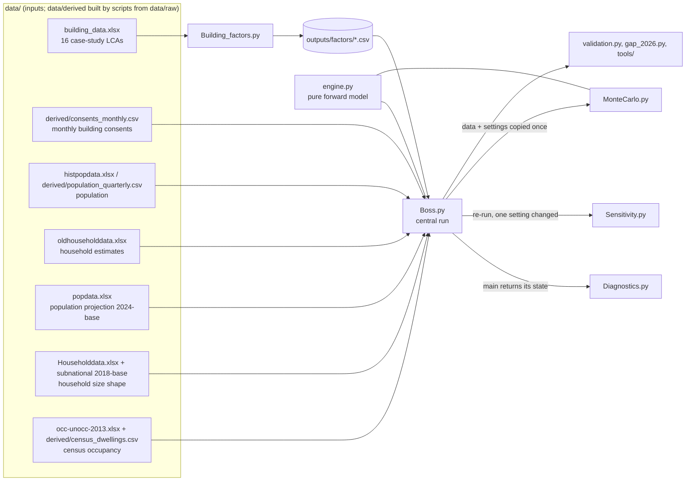
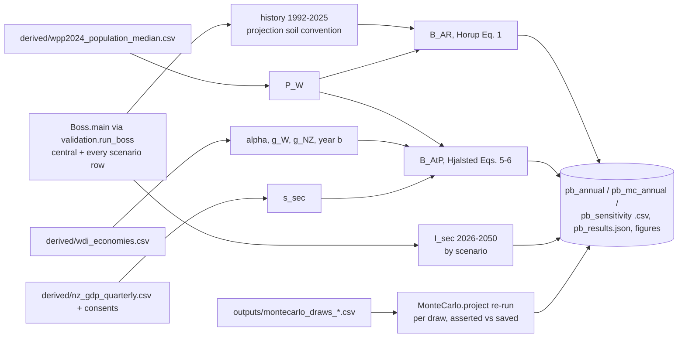

# Architecture: how the model works (baseline v2)

This document is for a reviewer who knows statistics or modelling but not this
code or New Zealand housing data. It describes what each script reads, what it
calculates and in what order, and what it writes. Headline numbers are not
repeated here: they are generated into [RESULTS.md](RESULTS.md),
`outputs/metrics.json` and `outputs/BASELINE_DRAFT.md`. Every setting, with its
basis (data, literature, author decision, judgement), is in
[ASSUMPTIONS.md](ASSUMPTIONS.md). Parameter values quoted below are the adopted
settings in `Boss.py`.

---

## 1. What the model answers

How much new residential floor area New Zealand will build from 2026 to 2050,
and how much embodied carbon that floor area carries, split by building type
(detached, townhouses, apartments), by reason for building (household growth,
vacancy, replacement, ...) and by material and life-cycle stage.

The model is bottom-up and demand-driven: people → households → dwellings
required → floor area → carbon. Construction capacity, prices and policy are not
modelled. Carbon intensities are the 2025 case-study values; with
`DECARB_MODE = 'horup_item'` (adopted) the A1–A3 part of each case-study EPD
item, and with `'horup_class_v1_1'` that of each mapped material class, follows
the material-specific GWP paths of Horup et al. (2025) from 2026 (section 4.9);
with `'none'` every factor is held at 2025 (frozen technology).

---

## 2. Scripts and data flow


```mermaid
flowchart LR
    subgraph inputs["data/ (inputs; data/derived built by scripts from data/raw)"]
        BD[building_data.xlsx<br/>16 case-study LCAs]
        CM[derived/consents_monthly.csv<br/>monthly building consents]
        HP[histpopdata.xlsx / derived/population_quarterly.csv<br/>population]
        OH[oldhouseholddata.xlsx<br/>household estimates]
        PP[popdata.xlsx<br/>population projection 2024-base]
        HH[Householddata.xlsx + subnational 2018-base<br/>household size shape]
        CE[occ-unocc-2013.xlsx + derived/census_dwellings.csv<br/>census occupancy]
    end
    BF[Building_factors.py] --> F[(outputs/factors/*.csv)]
    BD --> BF
    F --> BOSS[Boss.py<br/>central run]
    ENG[engine.py<br/>pure forward model] --- BOSS
    ENG --- MC
    CM & HP & OH & PP & HH & CE --> BOSS
    BOSS -->|main returns its state| DIAG[Diagnostics.py]
    BOSS -->|re-run, one setting changed| SENS[Sensitivity.py]
    BOSS -->|data + settings copied once| MC[MonteCarlo.py]
    BOSS --> VAL[validation.py, gap_2026.py, tools/]
```

`python run_all.py` runs everything in a fixed order (see README), each script
in its own process, and writes to `outputs/`. **One engine:** the forward model
is in `engine.py` (stock calibration, census dwelling-count rates, replacement
path, near-term market excess, typology mix, forward projection). These are pure
functions; `Boss.py` and `MonteCarlo.py` both call them. `Boss.main()` returns a
dictionary of all its local variables, which the other scripts read.

---

## 3. `Building_factors.py`: carbon per square metre

1. Each case study's absolute emissions (by material and EN 15978 stage) are
   divided by its gross floor area (GFA).
2. Materials are grouped into six lines: concrete, steel, timber, plastics &
   paint, plasterboard, others.
3. Buildings are pooled into three typologies: equal weight within sub-type,
   then equal weight across sub-types. A_2 duplicates A_1 (scaled by
   1.000073), so apartments have one independent case.
4. Soil carbon is land-use change, not a material: soil loss per m² of floor =
   soil loss per m² of footprint (58.77 kg CO₂e/m², area-weighted over the soil
   orders of Auckland land zoned for urbanisation) / floor space index.
5. Stage D is written out but never added. Stages in scope: A1–A3, A4–A5,
   B2/B4, C1–C4.

Outputs: `factors_material.csv`, `factors_typology.csv`, `factors_building.csv`.

---

## 4. `Boss.py`: the central projection

### 4.1 Consents (history 1991–2025)

Monthly consents are summed to calendar years: floor area and dwellings by
typology, and an all-category dwelling count. Retirement-village (RV) units =
all-category − three typologies. RV units are dwellings in the stock but carry
no floor area or carbon (no RV case study); forward they are a constant share
of all dwellings built (ratio of sums 2016–2025, 5.6%). RV floor area is
reported separately, out of scope. Realised dwelling size = floor area /
dwellings, held per typology at its 2023–2025 average.

Dwellings built = 0.95 × consents (completion rate; Jones et al. 2024 bounds
0.92–0.96). No completion lag in the adopted run (Little's-law lag is a
sensitivity).

### 4.2 Population and households (history)

Population: estimated resident population at 31 December. Households: Stats NZ
Dwelling and Household Estimates (DHE) at 31 December. After the 2018 base the
DHE series is 0.888 × lagged consents, so increments after June 2018 are
scaled by one factor k = 0.824, chosen so that June 2023 grows over June 2018
by the census ratio of occupied + residents-away private dwellings. 2024–25
household values are consent-derived and not used as evidence (the household
size anchor is 2023).

### 4.3 Net replacement: the census dwelling-count identity

For each intercensal interval: net replacement = (completions − change in
census private dwellings) / stock-years, with completions corrected for the
change in dwellings under construction on census night. This uses neither the
household estimates nor the empty/away split (which breaks between 2013 and
2018). Long run (ratio of sums 1991–2023): 0.101% of stock per year; the
2018–2023 interval: 0.312%. A fixed BRANZ demolition rate (0.135%/yr) splits
the net rate into demolition and a residual (net unconsented additions); only
their sum is identified.

The household stock identity (built = new households + vacancy allowance +
vacancy change + net replacement) is still calibrated and printed for
comparison, and is used by the hindcast with one vacancy definition throughout
(the pooled 2018/2023 empty share).

### 4.4 Replacement scenarios

`engine.replacement_path`, three scenarios, all with typology shares held:
**Low (S1)** long-run rate throughout; **Reference (S3-10)** the 2018–2023 rate
fading to the long-run rate with a 10-year half-life (5 and 15 years as
sensitivities); **High (S2)** the 2018–2023 rate persists. The half-life is not
identifiable from the census record.

### 4.5 Population projection

Stats NZ 2024-base stochastic projection: the median path is observed 2025 plus
the published median growth (PCHIP between knots); the 5th/95th paths add the
published spread of the *level* about the median, shifted to zero in 2025.
2026 growth is observed (mean-quarter ERP, June quarter 2026 − June quarter
2025); later growth is the projection's, so the level shift is permanent.

### 4.6 Household size

`S_StatsNZ = population / households` at the shared knots of the 2018-base
subnational population and household projections (2018–2043). Interpolation:
one cubic Hermite through every knot (PCHIP derivatives at interior knots, zero
slope at 2043), held constant after 2043. Applied as a shape rebased on the
observed 2023 value; households = population / S for every population path.
Household decline is floored at zero (it becomes vacancy).

### 4.7 Typology mix

Floor-area shares are held at their 2022–2026 consented average in every
scenario (`MIX_MODE = 'held'`); 2026 uses the observed consented mix. The damped
additive-log-ratio trend (fitted on 2012–2025, φ = 0.8; `MIX_MODE = 'trend'`, or
`'storyline'` for S2 only, as in v1.0.2–v1.2) stays in the code but is not run or
reported: the typology mix is a pathway lever for the next paper.

### 4.8 Forward requirement and the near-term market excess

```
dwellings built (all categories) = new households + vacancy allowance (v held at the 2023 census)
                                   + net replacement (scenario rate × last year's stock)
                                   + near-term market excess
in-scope dwellings              = dwellings built × (1 − RV share)
floor area                      = in-scope dwellings × blended dwelling size
```

2026 building is observed: 0.95 × consents over the latest 12 observed months
(the year to July 2026). Its excess over the 2026 requirement is booked in
2026; from 2027 building stays above the requirement by gap_ref × ρ^(t−2026),
with gap_ref = building 2026 − requirement 2027 and ρ the estimated persistence
of departures from the calibrated identity. The excess is stock-adding (extra
vacancy, never absorbed); redevelopment booking, payback and the gap against
the 2026 requirement are sensitivities. 2026 floor area is fixed to the
observed consented GFA.

The floor area is reported in demand bands (bookkeeping; they add up to the
total): growth (net of consolidation), house-splitting, extra space per
dwelling, vacancy allowance, long-run background replacement (demolition net of
unconsented additions), the recent redevelopment wave (scenario − long run),
and the near-term market excess. In the figures RV units are removed from every
band in proportion (each band × (1 − RV share)), so all bands are in scope and
sum exactly to the typology total (tested).

### 4.9 Carbon

Floor area by typology × intensity, by band, material, soil and stage (all
stages booked in the year of construction). Upfront = A1–A5 + soil. Soil
applies only to floor area on new footprints: zero on the replacement bands
(land already settled).

**Material decarbonisation** (`DECARB_MODE`). `'none'`: every factor held at its
2025 value. `'horup_class_v1_1'` (adopted in baseline-pb-v1.1, then
`'horup_material'`): the A1–A3 factor of each case-study material class is multiplied,
year by year, by the relative GWP path of its counterpart in Horup et al. (2025)
SI Table S4 (average of 9 premise scenarios, relative to 2025; linear between
2025, 2030, 2040 and 2050). `Building_factors.py` does this per case study and
class before pooling (`factors_a13_decarb.csv`), so OTHERS follows its own
components (aluminium, bricks, glass, glass wool; the rest held).
`'horup_item'` (adopted from baseline-pb-v1.2): the same paths applied to each EPD item of the case
studies (`data/derived/material_items.csv`, built by
`data/build_material_items.py` from the supplied item table and checked against
`building_data.xlsx`), mapped one-to-one by `data/material_item_map.csv` to an
S4 row (direct; by Horup et al. p. 6 for other cementitious and wood-based
products; or a labelled proxy) or held (the lift); summed per building and
class, then pooled as before, so the 2025 totals are the class totals.
`DECARB_ITEM_CASE` selects its sensitivities (proxies held; NZ-made
electricity-intensive items held; lift at steel profile). A4–A5, B2, B4, C1–C4,
unmapped classes or held items and soil stay at 2025. The history (1991–2025)
always uses 2025 factors. The Monte Carlo bootstraps the same reduction per
case study with the same resampled cases. Coverage by mapping basis:
`outputs/factors/factors_a13_item_coverage.csv`.

---

## 5. `Diagnostics.py`

Runs `Boss.main()` once: household engines and the DHE/consent relationship
(diag_2), the stock bucket (diag_3), floor area (diag_4), carbon (diag_5) and
the vacancy-definition appendix (diag_3b). The history of the demand
decomposition is one bar per census interval (interval means, one vacancy
definition): between censuses annual detail is not identified. Accounting
identities and factor sums are checked in `tests/test_identities.py`.

## 6. `Sensitivity.py`

Re-runs `Boss.main()` with one setting changed per row: replacement scenarios
and half-lives, mix, household-size variants and tails, dwelling-size window,
completion rate and lag, census under-construction correction, near-term
booking and gap reference, soil on replacement, and the decarbonisation rows of
the adopted mode (`Sensitivity.DECARB_CASES`: frozen technology, plus STEEL at
steel profile when the class-level mode is adopted; the item-level
decarbonisation sensitivities are in the optional mode comparison). Population rows reuse Boss's 5th/95th paths;
carbon-factor and soil-order rows re-weight the central floor area. Writes `outputs/sensitivity_oat.csv`, `sens_1`, `sens_2`. One-at-a-time
ranges are not additive.

## 7. `MonteCarlo.py`

Within each scenario (S3-10 reference, S1, S2): 5,000 Latin hypercube draws of
population rank z (moving population between the published percentile levels
and household size between Stats NZ Low/Medium/High with the same z), a
dwelling-size multiplier, the completion rate (two-piece uniform with median
0.95) and a stratified bootstrap of the carbon factors. Each draw runs the same
`engine.py` chain; the central draw is checked against `Boss.main()` to 1e-9.
With decarbonised materials (`DECARB_MODE`), the bootstrap also resamples each
case study's A1–A3 reduction by year with the same resampled cases and
multipliers, so the random stream and every 2025-factor draw are unchanged.
Sobol first-order and total indices (reference scenario, 1,024 × 6
evaluations). This is within-scenario parametric uncertainty only; scenario,
mix, carbon-factor and soil bounds are reported separately (sens_1).

## 8. Validation, reports and run modes

**Frozen-technology check.** The adopted run decarbonises materials
(`DECARB_MODE = 'horup_item'`). `run_all.py` also runs Boss, Sensitivity,
MonteCarlo, the scenario table and PB with `DECARB_MODE = 'none'` (environment
`PATHWAY_FROZEN=1`) into `outputs/frozen/`; the v1.2.1 regression test compares
that run, and its own recomputation of the central run and scenario totals
under `'none'`, with v1.2.1 to 1e-9.

**Mode comparison (optional, `run_all.py --compare-modes`).** Every other
decarbonisation mode (now `'horup_class_v1_1'`) is run in full (Boss,
Sensitivity, MonteCarlo, PB; environment `PATHWAY_DECARB_MODE=<mode>`) into
`outputs/modes/<mode>/`, and `tools/decarb_modes.py` runs the item-level
decarbonisation sensitivities (a Boss run per case; cumulative LoE against the
stored reference boundaries) and writes `outputs/DECARB_MODES.md` and
`decarb_modes.json`, stamped with the UTC time and git commit. The default run
does not repeat it: RESULTS, BASELINE_DRAFT and PB_METHODS_DRAFT read the stored
result, state its date and commit, and flag it as stale when the adopted-mode
carbon differs from the current run. The class-level mode is checked against
the baseline-PB_v1.1 outputs by `tests/test_regression_pb_v1_1.py` (exact
equality; its file checks read the stored comparison run).

**Quick mode** (`run_all.py --quick`, development only): 1,000 Monte Carlo draws
per scenario, 128 Sobol base samples, no frozen-technology Monte Carlo, Monte
Carlo regression checks skipped; `metrics.json` (`run_mode`), the generated
documents and every figure are marked "QUICK RUN, not for reporting".


`validation.py`: rolling-origin hindcast of dwellings built from 2006, 2013 and
2018 (consistent vacancy definition), and the 2026 out-of-sample check (model
run without any 2026 data vs observed consents). `gap_2026.py`: decomposition of
the 2026 gap. `tools/`: near-term rule and scenario reports, report figures,
metrics, RESULTS.md, ASSUMPTIONS.md and BASELINE_DRAFT.md.
`tests/test_regression_v1_2_1.py` checks every headline number against v1.2.1.

## 9. `PB.py`: planetary-boundary layer (AESA, climate change)

A layer on top of the model outputs; nothing in the model changes. Equations
are pure functions in `aesa.py`; `PB.py` assembles data, runs and figures.


```mermaid
flowchart LR
    BOSS[Boss.main via validation.run_boss<br/>central + every scenario row] --> H[history 1992-2025<br/>projection soil convention]
    BOSS --> I[I_sec 2026-2050<br/>by scenario]
    MCD[outputs/montecarlo_draws_*.csv] --> MCR[MonteCarlo.project re-run<br/>per draw, asserted vs saved]
    WPP[derived/wpp2024_population_median.csv] --> PW[P_W]
    WDI[derived/wdi_economies.csv] --> A[alpha, g_W, g_NZ, year b]
    GDP[derived/nz_gdp_quarterly.csv + consents] --> S[s_sec]
    H --> BAR[B_AR, Horup Eq. 1]
    PW --> BAR & BATP[B_AtP, Hjalsted Eqs. 5-6]
    A --> BATP
    S --> BATP
    BAR & BATP & I & MCR --> OUT[(pb_annual / pb_mc_annual /<br/>pb_sensitivity .csv, pb_results.json, figures)]
```

1. **History.** Sector emissions 1992-2025 = built floor area by typology x
   the 2025 case-study factors, with soil only on the non-replacement floor
   area, as in `engine.forward`: net replacement in year y = census-interval
   rate x last year's stock x (1 - RV share) x dwelling size (2024-25: the
   2018-23 rate carried). The mean 2016-2025 is Ī_sec,base.
2. **Acquired rights.** B_AR(t) = SOS (Ī_sec,base / I_glob) x population
   modifier relative to t0 = 2025 (NZ: model path; world: WPP 2024 median,
   dated 31 December as the mean of 1 July t and t+1).
3. **Ability to pay.** α, g_W and g_NZ in base year b (latest year with ≥ 98%
   WDI population coverage of PPP GDP per capita), over the covered economies;
   s_sec = consented residential value / final consumption expenditure
   2016-2025. B_AtP(t) = SOS / P_W(t) x g_W/g_NZ x α x P_NZ(t) x s_sec.
4. **Scenarios.** Every deterministic scenario of
   `tools/replacement_scenarios.py` is re-run (full Boss run); they share the
   population path, so the boundaries are the same and only I_sec differs.
5. **Monte Carlo.** Each saved draw of S3-10, S1 and S2 is re-run through
   `MonteCarlo.project()` from its saved parameters (MonteCarlo.py unchanged);
   the run stops unless every draw reproduces its saved outputs to 1e-9. The
   boundaries are recomputed from each draw's NZ population path, and the AR
   base Ī_sec,base from the draw's case-study carbon factors (2025 technology)
   on the observed history, so factor uncertainty enters base and projection
   alike.
6. **Sensitivities** of cumulative LoE (reference scenario): source pair,
   GDP measure, AR base window, NZ population source, s_sec definition.

Settings, sources and limitations: top of `PB.py` and ASSUMPTIONS.md; methods
as implemented: `outputs/PB_METHODS_DRAFT.md`.

---

## 10. Glossary

| term | meaning |
|---|---|
| GFA | gross floor area, m² |
| DHE | Stats NZ Dwelling and Household Estimates |
| ERP | estimated resident population |
| S | average household size = population / households |
| v | vacancy rate = empty private dwellings / all private dwellings |
| RV | retirement-village unit |
| UC | dwellings under construction on census night |
| OLF | occupancy load factor = floor area per design occupant |
| FSI | floor space index = GFA / building footprint |
| ALR | additive log-ratio transform for shares that sum to one |
| φ | damping factor of the mix trend |
| ρ | persistence of departures from the calibrated stock identity |
| PCHIP | piecewise cubic Hermite interpolation, a shape-preserving spline |
| EN 15978 stages | A1–A3 product, A4–A5 construction, B2/B4 maintenance/replacement, C1–C4 end of life, D beyond the life cycle |
| upfront carbon | A1–A5 + soil loss |
| AESA | absolute environmental sustainability assessment |
| SOS | safe operating space: the global carrying capacity for climate change (kg CO₂-eq/yr) |
| AR / AtP | acquired rights / ability to pay (allocation principles) |
| LoE | level of exceedance = impact / boundary (> 1: exceeded) |
| s_sec | the sector's share of final consumption expenditure (upscaling, Hjalsted Eq. 6) |
